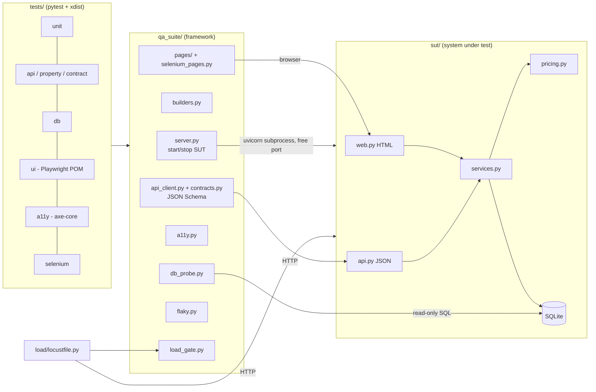

# assay

A Python test-automation framework for an included FastAPI/SQLite bookshop.

Repository: [srujanmalakpata/assay](https://github.com/srujanmalakpata/assay).

The suite covers REST API contracts, property-based inputs, persisted database state, browser flows, accessibility and load thresholds. Tests run in parallel with pytest-xdist and produce HTML and JUnit reports. The included GitHub Actions workflow is validated locally but has not run on GitHub; see [VERIFICATION.md](VERIFICATION.md). Twelve fixed bookshop defects and their regression tests are documented in [BUG_REPORTS.md](BUG_REPORTS.md).

## Features

| Area | What is implemented |
|---|---|
| System under test (`sut/`) | FastAPI + SQLite bookshop with server-rendered pages (sign in, search, book detail, cart, checkout, order confirmation) and a JSON REST API. It has deterministic seed data, starts with one `uvicorn` command, and ships with a Dockerfile. |
| Server lifecycle | A session fixture starts the SUT as a real `uvicorn` subprocess on a free port with its own temporary database. Each pytest-xdist worker gets its own server, and `/healthz` echoes a per-server instance id so a worker never mistakes another worker's server for its own. Setting `SUT_BASE_URL` points the suite at an existing server, such as docker compose. |
| Test-data builders | `UserBuilder` and `BookBuilder` are immutable fluent builders that create unique data through the public API, so tests never depend on one another. |
| API tests | httpx client wrapper. Responses are checked against hand-written JSON Schema (Draft 2020-12) contracts with `jsonschema`. Covers auth (401/403), validation (422), conflicts (409), authorization between users, and discount rules. Raw-JSON tests send what a lenient client can put on the wire (`NaN`, `Infinity`, lone `\ud800` surrogates, `true` as a quantity) and require a 422 whose body never echoes the rejected input. |
| Property-based tests | Hypothesis checks invariants against the live server: search soundness (every result matches) and completeness (any substring of a title finds that book), pagination, cart quantity validation (including any JSON type as the quantity), registration (pattern-valid usernames mixed with hostile text, with an exact 201-or-422 oracle), and "no id or page number ever causes a 500". It also checks the pricing rules and the LIKE-escaping helper. |
| HTML form tests | Crafted POSTs to the HTML endpoints, bypassing the browser's `min`/`max` attributes, check that the server validates quantities, ids, page numbers and search length itself. |
| DB-state assertions | `DbProbe` opens the SQLite file read-only and checks stock decrements, order rows, rollback on failed checkout, password hashing, hashed and expiring session rows, and session deletion on logout. It includes 8-thread race tests for overselling and for lost cart updates. |
| UI tests | pytest-playwright with a Page Object Model (`qa_suite/pages`). Traces and screenshots are kept only for failing tests. |
| Accessibility | axe-core 4.12 is injected through Playwright and checks WCAG 2.0/2.1 A and AA rules on every template, in empty, error, sold-out and populated states. Violations fail the test, and axe's "incomplete" checks are printed for manual review. A keyboard test checks that the skip link moves focus into `<main>`. |
| Selenium | Three flows (login, search, add to cart) with Selenium page objects and explicit waits. They are opt-in via `-m selenium`, and a failing test saves a screenshot. If no matching chromedriver exists they skip as "NOT RUN", except in CI, where `SELENIUM_REQUIRED=1` makes that a failure. |
| Load test | A Locust scenario with anonymous browsers and logged-in shoppers runs headless for 30 s. `qa_suite/load_gate.py` fails the run if p95 is over 300 ms, the error rate is over 1 % or fewer than 100 requests were made. |
| Flaky-test detector | `python -m qa_suite.flaky` reruns a selection N times and labels each test stable-pass, stable-fail or flaky (a test absent from a run is recorded as missing, never as passed, and a test that passes in one run but is skipped in another is flaky). It exits 1 on a failing or flaky test and 2 if pytest itself broke (bad arguments, nothing collected, a missing or unreadable JUnit file). It never retries a failure into a pass. |
| Reporting | pytest-html (self-contained) and JUnit XML, plus markers for `smoke`, `regression`, `unit`, `api`, `contract`, `property`, `db`, `ui`, `a11y` and `selenium`. |
| CI | A GitHub Actions workflow with jobs for lint, API, UI, accessibility, Selenium, load smoke, flaky check and docker compose, each uploading its reports and traces as artifacts. It is validated as YAML but has not run on GitHub yet. |

## Quick start

Requires Python 3.11+ and [uv](https://docs.astral.sh/uv/).

```bash
uv sync                                   # project-local .venv from uv.lock
uv run playwright install chromium        # once, for UI and a11y tests
uv run uvicorn sut.app:create_app --factory --port 8000   # open http://127.0.0.1:8000 (demo / demo-password)
```

With Docker:

```bash
mkdir -p compose-data && HOST_UID=$(id -u) HOST_GID=$(id -g) docker compose up -d --build --wait
```

## Architecture

[DESIGN.md](DESIGN.md) describes the design choices and trade-offs.



```
assay/
├── sut/            FastAPI app: api.py (JSON), web.py (HTML), services.py (rules), pricing.py (pure), db.py
├── qa_suite/       reusable framework: server, builders, API client, schemas, page objects, a11y, flaky, load gate
├── tests/          unit/ api/ db/ ui/ a11y/ selenium/  + conftest.py (fixtures)
├── load/           locustfile.py + run_load.py (starts a SUT and runs Locust headless)
├── examples/       flaky_demo: input for the flaky detector, not part of the real suite
├── Dockerfile, docker-compose.yml, Makefile, .github/workflows/ci.yml
```

## Running the tests

```bash
uv run pytest -n 2                         # everything except the opt-in Selenium suite
uv run pytest -m smoke                     # critical path only (23 tests)
uv run pytest tests/api -m property        # Hypothesis tests
uv run pytest -m a11y                      # axe-core scans
uv run pytest -m selenium                  # Selenium WebDriver variant
uv run pytest -n 2 --html=reports/report.html --self-contained-html --junitxml=reports/junit.xml
uv run python load/run_load.py --duration 30s               # Locust, thresholds enforced
uv run python -m qa_suite.flaky --runs 3 -- -m smoke         # flaky-test detector
SUT_BASE_URL=http://127.0.0.1:8000 SUT_DB_PATH=compose-data/bookshop.sqlite3 uv run pytest -n 2  # against the container
```

`make test`, `make smoke`, `make load`, `make flaky` and `make docker-test` wrap the same commands.
A failing Playwright test leaves `trace.zip` and a screenshot under `test-results/playwright/`. Open the trace with `uv run playwright show-trace <trace.zip>`.

## Results

All numbers were measured on a shared 4-vCPU Linux container on 2026-10-03, with other workloads running at the same time (load average 7-24 during these runs). See [VERIFICATION.md](VERIFICATION.md) for the exact commands.

| Measurement | Value |
|---|---|
| Tests collected | 231: 92 unit, 97 API, 9 DB, 18 UI, 12 accessibility, 3 Selenium |
| Default run (`pytest -n 2`) | 228 passed, 3 skipped (Selenium is opt-in), 75.1 s and 74.2 s (pytest-reported) on two runs |
| Same run without xdist | 228 passed, 3 skipped in 84.6 s. Runs on this machine show between no speed-up and about 1.4x from 2 workers, so there is no stable speed-up figure. |
| Selenium suite (`-m selenium`) | 3 passed |
| Suite against the docker compose container | 228 passed, 3 skipped in 66.3 s, 0 tracebacks in the container log; SUT image is 225 MB |
| Locust, 20 users, 30 s, local SUT | p95 26-80 ms across runs depending on machine load (26 and 37 ms in the recorded 30 s runs; 27 and 34 ms in other runs; 51-80 ms under heavier load). 858 and 862 requests, 0 failures, about 28.7 req/s. The gate (p95 300 ms, error rate 1 %, at least 100 requests) passed every time; the 300 ms threshold is the stable claim. |
| Load gate with `LOAD_P95_MS=1` (negative check) | Exit code 1. The gate reported the p95 and minimum-request breaches. |
| Flaky detector, 3 runs of the smoke suite | At load average 13-16: 23 stable-pass, 0 flaky, 0 stable-fail. An invocation during a load spike reported 1 flaky UI test (`failed failed passed`, Chromium "Target crashed" and a 30 s timeout); see the limitations. |
| Flaky detector on `examples/flaky_demo` (4 runs) | 1 stable-pass, 1 flaky (pass/fail/pass/fail), 1 stable-fail, exit code 1 |
| Flaky detector with a pytest usage error or no matching tests | Exit code 2, "nothing was verified" |
| axe-core 4.12.1 | 0 violations and 0 incomplete results in the 11 axe-scanning tests, plus 1 keyboard skip-link test |
| Real defects found in the bundled SUT and fixed | 12, with regression tests (see [BUG_REPORTS.md](BUG_REPORTS.md)) |

## Limitations

The Docker and CI configurations are validated locally; the project has never been deployed.

- The SUT is deliberately small, with one process and SQLite. Its load numbers say nothing about a production deployment, and the load test checks only that thresholds hold on the runner it uses.
- Browser coverage is Chromium only. Firefox and WebKit would only need `--browser firefox` in pytest-playwright, but they were not run here.
- The Selenium tests needed a chromedriver matching the pre-installed Chromium 141. Here Selenium Manager downloaded it (with `SE_SKIP_DRIVER_IN_PATH=true` and `CHROME_BINARY` set). If no driver can be obtained, the tests are skipped with a "NOT RUN" reason.
- The admin token (`dev-admin-token`) and demo password exist only so tests can create data. They are not secrets and must be overridden for any real use.
- There is no CSRF token on the HTML forms. Session cookies are `HttpOnly` and `SameSite=Lax`, which is enough for this demo but not for a real shop. Sessions are stored as SHA-256 digests and expire after 12 hours, but there is no rate limiting or account lockout on login.
- The schema has no migrations. An existing `data/` or `compose-data/` database from an older version must be deleted (the `sessions` table and the case-insensitive `users.username` column changed).
- The SUT and tests share an author, so their assumptions can share blind spots. Property strategies can miss huge integers, crafted form posts, lone surrogates, NaN and non-integer JSON; explicit regression cases cover the known defects.
- UI tests are sensitive to a heavily loaded machine. In one flaky-detector invocation during a load spike, Chromium's renderer crashed ("Target crashed") or a page did not become ready within 30 s in the first runs of a fresh pytest process, and once the SUT process exited with code 1 and no output. Other runs of the same tests are stable. The suspected cause is contention on the shared machine, but this is not proven; the detector reports these failures.
- Hypothesis runs at most 60 examples per live-server test to keep CI fast, so it can miss rare inputs. The bugs it found are now pinned with `@example` so they are checked on every run.

## License

MIT, see [LICENSE](LICENSE). axe-core (bundled inside the `axe-playwright-python` dependency) is MPL-2.0.
